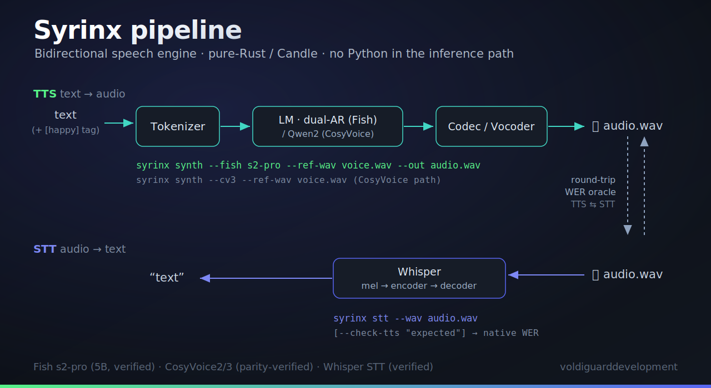

<div align="center">


# Syrinx

**A local, pure-Rust bidirectional speech engine — TTS *and* STT.**

Turn `text (+ voice) → audio` **and** `audio → text`, entirely on your own machine.
Clone a voice from seconds of reference audio, tag emotion inline (`[happy]`), and render
it on a single consumer GPU; then transcribe any clip back with a native Whisper. Every
inference path is **pure Rust** (Candle) — no Python. The two directions close a loop:
synthesize → transcribe → compare is Syrinx's own **WER oracle** for verifying the TTS.

[](https://github.com/voldiguarddevelopment/syrinx/actions/workflows/ci.yml)
[](https://www.rust-lang.org)
[](#license)
[](#how-this-was-built)

</div>

---

## What it is

Syrinx is a **bidirectional** speech engine designed to run **entirely on your own
machine**, both directions in **pure Rust** ([Candle](https://github.com/huggingface/candle)),
no Python in the inference path:

- **TTS (`text + voice → audio`)** — two model families. The primary path is a pure-Rust
  port of **Fish Audio's dual-AR TTS** (`s2-pro` 5B / `s1-mini` 0.5B): a semantic AR
  transformer + a fast AR head over an RVQ codec at **44.1 kHz**, with zero-shot voice
  cloning and inline, model-native **emotion/style tags** (`[happy]`, `[whispers]`). The
  original stack — pure-Rust ports of **CosyVoice2-0.5B / CosyVoice3-0.5B** (AR Qwen2 LM →
  flow-matching mel → HiFT vocoder, 24 kHz) — remains present and parity-verified.
- **STT (`audio → text`)** — **`syrinx-stt`**, a pure-Rust **Candle Whisper**. It makes
  Syrinx bidirectional and doubles as the **native WER oracle**: synthesize, transcribe,
  compare — which is how the TTS is objectively verified, with no external `faster-whisper`.

The design goal is the rare combination of **clone quality + expressive range +
local-only**, on a single consumer GPU.

> **Status — honest snapshot.**
> - **Fish `s2-pro` (5B) — VERIFIED on GPU.** The pure-Rust dual-AR port produces correct,
>   intelligible speech (confirmed objectively by the native Whisper oracle, **WER ≈ 0**),
>   with zero-shot voice cloning and inline emotion tags, clean across ~11 of 13 languages
>   tested. License = **Fish Audio Research License (non-commercial)**.
> - **Fish `s1-mini` (0.5B) — code-complete, not yet run.** The port compiles and is wired
>   end-to-end, but its weights are HF-gated and have **not** been downloaded/run yet.
> - **STT (Whisper) — VERIFIED on the box.** Transcribed a German clip → language `de` and
>   the exact text, pure Rust.
> - **CosyVoice2 / CosyVoice3 — parity-verified** (`text + ref → 24 kHz`; CV2 full-chain
>   7.7e-5, CV3 components ~1e-5–1e-3), each with a GPU runtime (RTF ≈ 1.67), CLI +
>   OpenAI-compatible server, measured eval (CV2 SIM-o ≈ 0.74, CV3 ≈ 0.88), and
>   emotion/instruct control.
>
> A plain `cargo build --features real` builds the real Candle stack (Fish + CosyVoice +
> Whisper). Real, weight-backed runs need the GPU box. See [Build status](#build-status)
> and [Roadmap](#roadmap).

---

## Highlights

- 🦀 **Pure-Rust, both directions.** Every inference path — TTS *and* STT — is Rust on
  Candle. No Python runtime anywhere in production.
- 🐟 **Fish `s2-pro` (5B) — verified.** The pure-Rust dual-AR port synthesizes correct,
  intelligible 44.1 kHz speech (objectively, native Whisper WER ≈ 0), with zero-shot
  cloning across ~11/13 languages tested. *(Non-commercial research license.)*
- 🗣️ **Speech-to-text.** `syrinx-stt` is a pure-Rust Candle Whisper — verified on the box
  (German clip → `de`, exact text). It also serves as the built-in **WER oracle** that
  objectively grades the TTS (synth → transcribe → compare).
- 😀 **Inline emotion tags.** `[happy]`, `[whispers]`, `(sighing)` … are **plain text**
  the model reads natively — no special-token wiring, no separate checkpoint.
- 🎙️ **Zero-shot cloning.** A reference clip → a cloned voice, no per-speaker fine-tuning
  (Fish `s2-pro` and CosyVoice2/3).
- 🎛️ **Voice library + manipulation.** Blend / interpolate / arithmetic over stored voices
  (`crates/syrinx-serve/src/voice`).
- ✏️ **Editable prosody.** A typed, serializable `RenderPlan` carries speech-rate and
  pitch (global + per-region). Speech-rate is faithful (≈ 1/rate); training-free **pitch
  is a weak lever** (the vocoder's mel envelope dominates — measured + documented).
  Per-*word*/phoneme targeting needs an aligner the base model doesn't expose.
- ⚡ **Streaming.** Chunk-aware incremental synthesis is implemented; **sub-200 ms TTFB is
  a design target** (needs a causal cached flow + GPU), not yet a measured result, and the
  stream is not yet sample-identical to the batch path.
- 🌍 **Cross-lingual & multi-accent** transfer — *research-tracked, not yet validated*
  (needs an ASR-based eval).
- 🔬 **Parity-gated correctness.** Every numerical stage of the real model is checked
  against the PyTorch reference within tolerance — "done" means the frozen test passes,
  never an assertion.
- 🔒 **Real, honest watermark.** An **opt-in** spread-spectrum watermark
  (`Synthesizer::synthesize_watermarked`, plus the model-free `watermark` embed/detect
  module), imperceptible and detectable after light processing — *not* adversarially
  robust (see Ethics).

---

## Architecture



Syrinx is two flows that share a codebase and close a loop:

**TTS — `text (+ voice) → audio`.** Two model families behind one `synth` command:

- **Fish dual-AR (primary, 44.1 kHz).** Tokenizer → a **slow** semantic AR transformer
  (Qwen3-4B for `s2-pro`, Llama-style for `s1-mini`) predicts one semantic code per frame;
  a small **fast** AR head expands it into the residual RVQ codes; an RVQ **codec**
  (EVA-GAN / causal-DAC) decodes the `[10, T]` matrix to waveform. Emotion/style tags are
  plain text on the way in.
- **CosyVoice2 / CosyVoice3 (24 kHz).** Frontend → **AR Qwen2 LM** → **flow-matching mel**
  decoder (CV2 conformer / CV3 22-layer DiT) → **HiFT vocoder**, with a CAM++ speaker
  encoder providing the zero-shot clone conditioning.

**STT — `audio → text`.** `syrinx-stt` runs **Whisper** (log-mel front end → encoder →
decoder) in pure Rust, reusing `candle-transformers`. It is the mirror of the TTS stack
and the **WER oracle** that grades it.

**The round-trip.** TTS and STT connect: synthesize a line, transcribe it back, compare
with the built-in `wer` — a native, Python-free intelligibility check on the real output.

> The diagram above is the current shipped pipeline. Fish `s2-pro` is verified on GPU;
> `s1-mini` is code-complete but unrun (HF-gated weights); the CosyVoice ports are
> parity-verified. An **int4** footprint is available opt-in on the CosyVoice path (CV2
> ≈ 388 MB / CV3 ≈ 488 MB) — a size win, not a speed win (dequant-on-fetch).

---

## Workspace layout

An eleven-crate Rust workspace; each crate owns one stage of the real pipeline.

| Crate | Responsibility |
|-------|----------------|
| [`syrinx-fish`](crates/syrinx-fish) | Pure-Rust Fish Audio dual-AR TTS port — `s2-pro` (5B) + `s1-mini` (0.5B): slow/fast AR + RVQ codec, 44.1 kHz (Candle) |
| [`syrinx-stt`](crates/syrinx-stt) | Pure-Rust Candle **Whisper** speech-to-text + the model-free `wer` oracle |
| [`syrinx-frontend`](crates/syrinx-frontend) | Qwen2 BPE text tokenizer, wetext-style normalization (`tn`), kaldi fbank + prompt mel, `speech_tokenizer_v2/v3.onnx` |
| [`syrinx-lm`](crates/syrinx-lm) | Real CV2/CV3 Qwen2-0.5B LM forward (Candle) + KV-cache autoregressive generation |
| [`syrinx-speaker`](crates/syrinx-speaker) | Real CAM++ x-vector speaker encoder (Candle) |
| [`syrinx-acoustic`](crates/syrinx-acoustic) | Real flow-matching mel decoder — CV2 conformer / CV3 22-layer DiT (Candle) |
| [`syrinx-vocoder`](crates/syrinx-vocoder) | Real HiFT vocoder — CV2 + CV3 causal-f64 variant (Candle) |
| [`syrinx-prosody`](crates/syrinx-prosody) | Editable prosody plan model + render-time rate/pitch transforms |
| [`syrinx-serve`](crates/syrinx-serve) | End-to-end `Synthesizer` capstone, OpenAI-compatible `/v1/audio` server, voice library + manipulation, watermarking |
| [`syrinx-eval`](crates/syrinx-eval) | Measured SIM-o/WER/MOS/RTF/TTFB metrics over the real synthesizer |
| [`syrinx-cli`](crates/syrinx-cli) | `syrinx synth\|serve\|stream\|stt` (Fish `--fish`, CosyVoice `--cv3`, Whisper `stt`) |

---

## Build status

Syrinx is built **test-first behind deterministic gates** (see
[How this was built](#how-this-was-built)). A task is `done` only when its frozen tests
pass — there are no stubbed greens.

**🐟 Fish Audio dual-AR port — the primary TTS**

Pure-Rust / Candle ports of Fish Audio's open dual-AR TTS stack (`crates/syrinx-fish`),
non-commercial research license:

- **`s2-pro` (5B) — VERIFIED on GPU.** Qwen3-4B slow AR + a ~400M fast AR head (single
  shared embedding, codebook identity carried by RoPE + MCF fusion) + a 446M EVA-GAN /
  causal-DAC RVQ codec at **44.1 kHz**. It produces **correct, intelligible speech**,
  confirmed *objectively* by the native Whisper oracle (**WER ≈ 0**), with zero-shot voice
  cloning and inline emotion/style tags, clean across ~11 of 13 languages tested.
- **`s1-mini` (0.5B) — code-complete, not yet run.** Llama-style dual-AR + modded-DAC codec,
  wired end-to-end and compiling; its weights are **HF-gated** (need an HF token to
  download), so it has **not** been executed on hardware yet.

> **Honest caveats.** The Fish models are **non-commercial** (Fish Audio Research License).
> `s2-pro` is 5B — bf16 inference needs ~12 GB VRAM (multi-sample batching ≥16 GB). Its
> German/Dutch **cross-lingual voice cloning** is limited by the reference clip's phoneme
> coverage (the model synthesizes those phonemes fine when *not* cloning) — a ref-coverage
> limitation being addressed with a larger custom reference, not a code bug.

**🗣️ Speech-to-text (Whisper) — VERIFIED on the box**

`syrinx-stt` is a pure-Rust **Candle Whisper** (`candle-transformers` `Whisper` +
log-mel front end; the official SOT/language/transcribe decode loop with a temperature
fallback and non-speech suppression). Verified on the box: a German clip transcribed to
language `de` with the exact text, **pure Rust — no `faster-whisper`**. Models:
`openai/whisper-{tiny,base,small,medium,large-v3}`. It doubles as the **native WER oracle**
(the model-free `wer` helper is always available, even in a Candle-free build).

**✅ Real CosyVoice2 model — DONE (a standalone, near-real-time Rust TTS)**

The real **CosyVoice2-0.5B** model is reimplemented in pure-Rust
**[Candle](https://github.com/huggingface/candle)** and verified numerically against the
real PyTorch model. The real ports are the **default build** (Candle is a normal
dependency):

- **LM** — Qwen2-0.5B forward + **KV-cache autoregressive generation**: logits 1.3e-4,
  per-step gen logits 2.9e-5, argmax-exact.
- **Speaker** — CAM++ x-vector (architecture recovered from the `campplus.onnx` graph): 1.3e-5, cosine 1.0.
- **Acoustic** — flow-matching mel (conformer + CFM Euler ODE + zero-shot prompt conditioning): mel 1.3e-5.
- **Vocoder** — HiFT (upsample + Snake ResBlocks + iSTFT-via-inverse-DFT): waveform 5.2e-5.
- **Frontend** — Qwen BPE tokenizer (exact) · kaldi fbank + prompt mel (1e-3) · `speech_tokenizer_v2.onnx` (exact, via `ort`).
- **`Synthesizer`** (`syrinx-serve::synth`) — `synthesize(text, ref_audio) → 24 kHz audio`,
  full-chain deterministic parity **7.7e-5**. **No Python in the inference path.**
- **GPU runtime** (`cuda` feature, Candle-CUDA) — full synth **~26× faster**, **RTF ≈ 1.67**
  (near real-time) on a single consumer GPU.

The parity fixtures (real weights + Python reference dumps) live on the model box, so these
tests are **env-gated and skip cleanly in CI** — the build stays green without the weights,
while the real path runs for real where the weights exist.

**✅ Real CosyVoice3 model — DONE (a second pure-Rust CosyVoice, feature-complete)**

The newer **CosyVoice3-0.5B** (`Fun-CosyVoice3-0.5B-2512`) is now *also* a full pure-Rust
Candle port, built the same parity-driven way and reusing ~70 % of the CV2 code (CAM++
speaker as-is, the Qwen2 LM body, the CFM Euler/CFG solver, the matcha mel + `ort` wiring):

- **LM** (`CosyVoice3LM`) — Qwen2 body + CV3 head (sos/task from `speech_embedding`, bias-free
  `llm_decoder`): teacher-forced logits **2.67e-5**.
- **Flow** — a **new 22-layer DiT** estimator (dim 1024, rotary + AdaLN) replacing CV2's U-Net,
  with a PreLookahead front-end + vocab-6561 input embedding: **2.27e-3** (the fp32 accumulation
  floor — proven: torch's own fp32-vs-fp64 on this DiT is 1.34e-3).
- **Vocoder** — `CausalHiFTGenerator` (causal convs + a **float64** f0-predictor): audio **4.9e-5**.
- **Frontend** — `speech_tokenizer_v3.onnx` (87/87 ids exact) + the matcha prompt-mel (**3.72e-5**).
- **Live synthesis** (`Cv3Synthesizer`, `text + ref → 24 kHz`) — measured **SIM-o 0.88** (voice clone,
  *better* than CV2's 0.74) and **MOS-proxy 2.21** (with the real SineGen source). The `<|endofprompt|>`
  marker is required for all CV3 inference.
- **Feature-complete:** CLI (`synth/serve --cv3`) · HTTP server (`Cv3RealSynth`) · 5-metric eval
  (`evaluate_cv3`) · emotion/instruct (`synthesize_instruct`) · real-SineGen quality source ·
  RL-LM variant (`llm.rl`) · int4 footprint (~488 MB) · **chunked-causal streaming**
  (`synthesize_streaming`, the DiT chunk-mask — finalized frames bit-stable, 0.0 vs 2.28 non-causal).
- **Measured extras:** the **RL LM is the quality winner** (SIM-o 0.845 / MOS 3.03 with the quality
  source) · **cross-lingual** zh-voice → English carries (SIM-o 0.76, MOS 4.28) · int4 is honestly a
  **size-only, lossy + slow** tradeoff (SIM-o 0.47, RTF 243) — opt-in, not the default.

> The hard win was the live decode: a repetition-aware-sampling fallback that masked the repeated
> token (which the reference doesn't) collapsed generation; a pin-reference-token diagnostic proved
> the model itself was correct (pinned → SIM-o 0.69) and isolated the one-line fix that took live
> SIM-o **0.24 → 0.88**.

---

## The parity approach (why the numbers are trustworthy)

Every numerical stage of the real port is gated against **golden fixtures dumped from the
real PyTorch CosyVoice2 / CosyVoice3 models** — the real pretrained weights and the
reference's intermediate activations. The Rust (Candle) stage must match within documented
tolerances (≈1e-4/1e-5 per stage, down to the fp32 accumulation floor on the CV3 DiT), so
"done" means a frozen parity test passes against the real model, never an assertion. See
[`PARITY.md`](PARITY.md) and [`REFERENCE.md`](REFERENCE.md).

---

## Getting started

> **Heads up:** the **default build is the real CosyVoice2 / CosyVoice3 model stack** —
> a plain `cargo build` pulls Candle and compiles the real ports. Weights are supplied at
> runtime via the `SYRINX_*` env vars (or `--model-dir`); the parity tests are env-gated and
> skip without them. `--features cuda` adds the GPU path.

```bash
# Build the whole workspace (default = the real model stack, Candle-backed)
cargo build --workspace

# Run the test suite (real parity/eval tests skip cleanly without on-disk weights)
cargo test --workspace

# CLI help
cargo run -p syrinx-cli -- --help
```

**Fish synthesis (primary)** — `text (+ ref voice) → 44.1 kHz wav`. Add `--features cuda`
+ `--cuda` for the GPU path (`s2-pro` effectively needs it):

```bash
# Fish s2-pro (verified): zero-shot clone + inline emotion tags. --fish-dir holds the
# checkpoint (model + config.json + codec + tokenizer); --ref-wav clones the voice.
cargo run -p syrinx-cli --features cuda -- synth \
  --fish s2-pro --fish-dir /models/fish-s2-pro --cuda \
  --text "[happy] We finally shipped it!" \
  --ref-wav voice.wav --out audio.wav

# Fish s1-mini (code-complete, HF-gated weights — not yet run): no reference cloning path,
# so --ref-wav is ignored for s1-mini.
cargo run -p syrinx-cli --features real -- synth \
  --fish s1-mini --fish-dir /models/fish-s1-mini \
  --text "(sighing) Here we go again." --out audio.wav

# Batch-render a corpus (loads the variant once, then loops): --batch <jsonl> --out-dir
cargo run -p syrinx-cli --features cuda -- synth \
  --fish s2-pro --fish-dir /models/fish-s2-pro --cuda --ref-wav voice.wav \
  --batch samples/fish-samples.jsonl --out-dir out/s2-pro --batch-size 4
```

**Speech-to-text** — `audio → text` (pure-Rust Whisper; the TTS test oracle):

```bash
# Transcribe a WAV; --model-dir points at an openai/whisper-* checkpoint dir.
cargo run -p syrinx-cli --features cuda -- stt \
  --wav audio.wav --model-dir /models/whisper-large-v3 --cuda --lang de

# Grade a TTS render: transcribe and print the word error rate vs the expected text.
cargo run -p syrinx-cli --features cuda -- stt \
  --wav audio.wav --model-dir /models/whisper-large-v3 --cuda \
  --check-tts "We finally shipped it!"
```

**CosyVoice synthesis** — `text + reference clip → 24 kHz wav`. Pick CV3 with `--cv3`:

```bash
# CosyVoice2 (default): weights via SYRINX_*_WEIGHTS env (or --model-dir)
cargo run -p syrinx-cli -- synth \
  --text "Hello from Syrinx." --prompt-text "<ref transcript>" \
  --ref-wav ref.wav --out out.wav

# CosyVoice3: same CLI, add --cv3 (weights via SYRINX_CV3_*; v3 speech tokenizer)
cargo run -p syrinx-cli -- synth --cv3 \
  --text "收到好友从远方寄来的生日礼物。" --prompt-text "希望你以后能够做的比我还好呦。" \
  --ref-wav ref.wav --out out_cv3.wav

# OpenAI-compatible server (either CosyVoice model): `serve` / `serve --cv3`
cargo run -p syrinx-cli -- serve --cv3 --ref-wav ref.wav --port 8080
curl -s localhost:8080/v1/audio/speech -H 'content-type: application/json' \
  -d '{"model":"syrinx-cv3","input":"hello","voice":"v","response_format":"wav"}' -o out.wav
```

**Requirements:** a stable Rust toolchain. Weight-backed runs need the model on disk — the
Fish `s2-pro`/`s1-mini` checkpoint, a Whisper checkpoint, or the CosyVoice2/3 weights (the
parity/e2e tests are env-gated on them and skip cleanly without). The **`cuda`** path needs
an NVIDIA GPU + the Candle-CUDA toolchain (`s2-pro` is 5B — ~12 GB VRAM in bf16). One-run
verification on the model box: **`./scripts/verify.sh`** (see *Verifying the build* in
`CLAUDE.md`), which exercises CV2 · CV3 · Fish `s1-mini` · Fish `s2-pro` · voice · emotion.

---

## How this was built

Syrinx is built by **[Ratchet](https://github.com/voldiguarddevelopment/Ratchet)**, a
hardened autonomous TDD harness. Every change goes through a strict gate cascade —
integrity → checker → compile → frozen tests → mutation — and the project's three
documents (`plan.md` / `spec.md` / `list.md`) are reconciled against the code on every
pass. The core rule: **no stubs, no simplified implementations, no fake passes** — a
green that isn't real is rejected by construction. State lives in disk + git history, so
each pass re-derives correctness from scratch.

That is why the build status above is precise about what is *proven* versus *pending*:
the harness will not mark a task done on belief.

---

## Roadmap

**Done (real, verified):**
- [x] Eleven-crate workspace + CI (the real ports are the default build)
- [x] **Fish `s2-pro` (5B) dual-AR port — VERIFIED on GPU** — pure-Rust Qwen3-4B slow AR +
  fast AR head + EVA-GAN/causal-DAC RVQ codec, 44.1 kHz; intelligible (native Whisper
  WER ≈ 0), zero-shot cloning + inline emotion tags, ~11/13 languages. Non-commercial license.
- [x] **Speech-to-text (`syrinx-stt`) — VERIFIED on the box** — pure-Rust Candle Whisper
  (`whisper-{tiny…large-v3}`); German clip → `de`, exact text; doubles as the native WER oracle
  (replaces the external `faster-whisper`). No Python.
- [x] **Real CosyVoice2-0.5B port** — LM (+ KV-cache gen) · CAM++ speaker · flow-matching · HiFT · frontend, all Candle, all parity-verified
- [x] **End-to-end `Synthesizer`** — `text + ref → audio`, full-chain parity 7.7e-5, no Python on the hot path
- [x] **GPU runtime** (Candle-CUDA) — ~26×, RTF ≈ 1.67 (near real-time on a consumer GPU)
- [x] **CLI + server** — `syrinx synth|serve|stream`; OpenAI-compatible `POST /v1/audio/speech` returns real audio
- [x] **Text normalization** — wetext-style zh+en (~95% match to the reference), wired into the real path (`tn` feature)
- [x] **Editable prosody** — speech-rate (faithful, ≈1/rate) + a typed `RenderPlan`; **pitch is a weak training-free lever** (the HiFT mel filter dominates perceived pitch — measured + documented)
- [x] **Measured eval — 5/5, no stub constants** — SIM-o clone fidelity (≈0.74), **WER** (Whisper CER ≈0%), **MOS-proxy** (UTMOS), RTF, TTFB. WER/MOS run via eval-side helper models (Whisper / UTMOS); the inference path stays pure-Rust
- [x] **int4 (Q4_0) LM quant** — ~2.5× (2449 → 986 MB, SIM-o 0.72 preserved); the f16 embedding tables are the remaining bulk
- [x] **Output watermark** — spread-spectrum, imperceptible + detectable after light processing (see *Ethics*)
- [x] **Real CosyVoice3-0.5B port — feature-complete** — LM (2.67e-5) · **new 22-layer DiT flow** (2.27e-3, fp32 floor) · causal f64 HiFT (4.9e-5) · v3 tokenizer (exact) · frontend (3.72e-5); live synth **SIM-o 0.88 / MOS 2.21**; CLI/server/eval/emotion/quality-source/RL-LM/int4 all wired (`--cv3`). ~70% CV2 reuse; see *Real CosyVoice3 model* above.

**Forward (honest):**
- [ ] **Fish `s1-mini` first run** — the 0.5B port is code-complete but its weights are
  HF-gated; it needs an HF token + a download to run on hardware.
- [ ] **Larger custom cross-lingual voice-clone reference** — `s2-pro` synthesizes
  German/Dutch phonemes fine *non-cloned*, but cross-lingual *cloning* is bounded by the
  reference clip's phoneme coverage; a larger custom reference is the fix (a data item, not a
  code bug).

**Not yet (honest):**
- [x] **Sample-faithful streaming** — CV2's chunked-causal attention mask (same weights) makes the streamed mel frames **bit-stable** (`real_flow_stream_consistency`: 0.0 diff vs 0.53 for the old non-causal path), and the **streamed audio is intelligible — Whisper CER 0.0**, identical to batch. (Streamed audio is *not* sample-identical to the batch — CV2's streaming cross-fades by design; details in [`STREAMING.md`](crates/syrinx-acoustic/docs/STREAMING.md).) Sub-200 ms TTFB remains a design target (CPU TTFB is LM-bound).
- [x] **Emotion / instruct control** — `synthesize_instruct(tts, instruct, ref)` on the **same CosyVoice2-0.5B weights** (no separate checkpoint — CV2 unified instruct into the base): the instruct text takes the LM prompt-text role + the prompt speech tokens are dropped, while the flow keeps the cloned voice. Verified — emotions measurably change the output (sad / cheerful / neutral differ in MOS + SIM-o) while preserving speaker identity.
- [ ] **Cross-lingual eval set** — the SIM-o/WER/MOS harness already handles it; just needs a multilingual frozen eval set + a sweep (the Whisper helper is language-aware).
- [x] **Smaller footprint** — int4 LM linears + int4 embeddings + int4 flow/HiFT/speaker + **dropping the unused `lm_head`** (519 MB of dead weight CV2's speech path never calls) land the whole model at **388 MB** (from ~2983 fp32, **~7.7×**). The README's "270 MB" budget under-counted the Qwen2-0.5B body; 388 MB is the honest 4-bit floor. ⚠️ The int4 dequant-on-fetch is **slow to load/infer** — it's an **opt-in** path (`load_quantized`), not the default; fast int4 kernels are the follow-up.
- [x] **Perceptual-quality source + CFM noise** — `synthesize_quality` uses the real random-phase NSF SineGen (8 overtones + uv mask + Gaussian breath + learned source merge) **and** a seeded standard-normal CFM init (the model's `rand_noise`) instead of the deterministic zero-phase source + zeros. Measured UTMOS: **2.03 → 2.21 (source) → 2.36 (+`z`)**. Remaining quality headroom is the capped-gen mel + the model's true RNG byte-stream (not portable).
- [x] **Consolidation** — the original Ratchet build-methodology scaffold (the GPU-less,
  FNV-name-seeded "deterministic spec engine" proxy: `syrinx-core`, `syrinx-stream`, the toy
  LM/attention/tensor modules, the eval-harness skeleton, the toy prosody/eval tests) has been
  **removed**; the real CosyVoice2/3 ports are now the primary/default build.

See [`DESIGN.md`](DESIGN.md) for the full task-based plan.

---

## Ethics & consent

Voice cloning is powerful and abusable. Syrinx ships a **spread-spectrum watermark** as
an **opt-in** capability — `Synthesizer::synthesize_watermarked(.., key, payload)` (CV2),
backed by the model-free `syrinx-serve::watermark` embed/detect module that works on any
24 kHz mono buffer (so it is unit-tested at the repo root without the model). It is
**not** wired into the default CLI/server output path — callers opt in per render. The
mark is key-seeded, imperceptible (≈ −48 dBFS), and detectable after **light** processing
— high-bitrate re-encoding, gain changes, light noise, and integer-sample crops. It is
**not** adversarially robust: aggressive low-bitrate MP3/Opus, time-stretch/resample, or
deliberate removal defeat it — that needs a *learned*, perceptually-masked scheme
(AudioSeal / WavMark), tracked as future work. See
[`crates/syrinx-serve/docs/WATERMARK.md`](crates/syrinx-serve/docs/WATERMARK.md) for the
honest robustness boundary. Cloning is meant to be gated behind a usage policy — do not
clone a voice you do not have the right to use.

---

## License

License TBD. Until a license file is added, all rights reserved by the project owners.

<div align="center">
<sub>Built with 🦀 and <a href="https://github.com/voldiguarddevelopment/Ratchet">Ratchet</a> · voldiguarddevelopment</sub>
</div>
