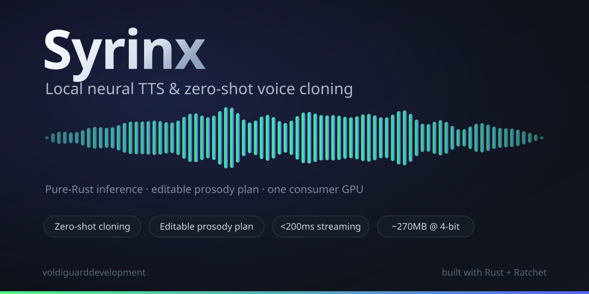

<div align="center">



# Syrinx

**A local, Rust-served neural TTS + zero-shot voice-cloning engine.**

Clone a voice from seconds of reference audio and render it near real-time on a single
consumer GPU — with editable speech-rate prosody as a typed plan, not a black box.
Inference is **pure Rust** (Candle); no Python on the hot path. (Emotional control and
sub-200 ms streaming are on the roadmap, not yet shipped — see [Status](#what-it-is).)

[](https://github.com/voldiguarddevelopment/syrinx/actions/workflows/ci.yml)
[](https://www.rust-lang.org)
[](#license)
[](#how-this-was-built)

</div>

---

## What it is

Syrinx is a text-to-speech and voice-cloning engine designed to run **entirely on your
own machine**. It pairs an autoregressive semantic language model (for control and
paralinguistics) with a non-autoregressive flow-matching acoustic decoder (for fast,
high-fidelity waveform synthesis) — each paradigm used where it is strongest.

The design goal is the rare combination of **clone quality + expressive range +
low latency + local-only**, on a single RTX&nbsp;4090-class GPU, with a **~270&nbsp;MB
4-bit footprint**.

> **Status — honest snapshot.** The **real CosyVoice2-0.5B model is fully reimplemented
> in pure-Rust [Candle](https://github.com/huggingface/candle) and parity-verified**
> (`text + ref → 24 kHz audio`, full-chain 7.7e-5) — with a GPU runtime (RTF ≈ 1.67), a
> CLI + OpenAI-compatible server, zh+en text normalization, faithful speech-rate control,
> measured eval (SIM-o ≈ 0.74 clone fidelity), an int4-quantized LM, and an output
> watermark. **Not yet:** sample-faithful streaming (needs a causal flow), emotion /
> paralinguistic control (needs the instruct checkpoint), and cross-lingual / WER eval
> (needs ASR). The original "deterministic spec engine" was Ratchet's GPU-less, parity-gated
> *proxy*; the real pipeline supersedes it (and orphans some of it). See
> [Build status](#build-status) and [Roadmap](#roadmap).

---

## Highlights

- 🦀 **Pure-Rust inference.** The whole render path — frontend → LM → prosody plan →
  acoustic decoder → vocoder — is Rust. No Python runtime in production.
- 🎙️ **Zero-shot cloning.** A reference clip → a speaker embedding → a cloned voice,
  no per-speaker fine-tuning.
- ✏️ **Editable prosody.** A typed, serializable `RenderPlan` carries speech-rate and
  pitch (global + per-region). Speech-rate is faithful (≈ 1/rate); training-free **pitch
  is a weak lever** (the vocoder's mel envelope dominates — measured + documented).
  Per-*word*/phoneme targeting needs an aligner the base model doesn't expose.
- ⚡ **Streaming.** Chunk-aware incremental synthesis is implemented; **sub-200 ms TTFB is
  a design target** (needs a causal cached flow + GPU), not yet a measured result, and the
  stream is not yet sample-identical to the batch path.
- 🌍 **Cross-lingual & multi-accent** transfer — *research-tracked, not yet validated*
  (needs an ASR-based eval).
- 🔬 **Parity-gated correctness.** Every numerical stage of the real model is checked
  against the PyTorch reference within tolerance — "done" means the frozen test passes,
  never an assertion.
- 🔒 **Real, honest watermark.** A spread-spectrum watermark on every output, imperceptible
  and detectable after light processing — *not* adversarially robust (see Ethics).

---

## Architecture

```
text ─▶ [Frontend] ─▶ [AR Semantic LM] ─▶ [Prosody Plan] ─▶ [NAR Flow Decoder] ─▶ [Vocoder] ─▶ 48 kHz
        (Rust,          (control,           (editable          (acoustic, chunk-      (HiFi-GAN/
       deterministic)  paralinguistics)     dur + pitch)        aware, speaker-       Vocos)
                                                                cond.)  ▲
                                          [Speaker Encoder] ───────────┘
                                          (embed · blend · morph · attributes)
```

**Two paradigms, each where it wins:** an **autoregressive** semantic LM owns control
and paralinguistic tokens; a **non-autoregressive** flow-matching decoder owns the
acoustic frames so first-byte latency is one chunk, not one utterance.

**Parameter budget (pre-quant ~420M):** LM ~250M · acoustic ~120M · speaker enc ~30M ·
vocoder ~20M → **~270&nbsp;MB at 4-bit**.

---

## Workspace layout

An eleven-crate Rust workspace; each crate owns one stage of the pipeline.

| Crate | Responsibility |
|-------|----------------|
| [`syrinx-frontend`](crates/syrinx-frontend) | Text normalization, numbers/dates, G2P, SSML, lexicon, heteronyms, context windowing |
| [`syrinx-core`](crates/syrinx-core) | Tensor ops, weight loading, quantization, device management |
| [`syrinx-lm`](crates/syrinx-lm) | Autoregressive semantic LM forward pass + paralinguistic tokens |
| [`syrinx-speaker`](crates/syrinx-speaker) | Speaker encoder, embedding store, blend/morph, attributes |
| [`syrinx-acoustic`](crates/syrinx-acoustic) | Flow-matching decoder (DiT blocks + ODE solver), chunk-aware streaming |
| [`syrinx-vocoder`](crates/syrinx-vocoder) | HiFi-GAN/Vocos waveform synthesis, 48 kHz / 8 kHz paths |
| [`syrinx-prosody`](crates/syrinx-prosody) | Editable prosody plan model + override API |
| [`syrinx-stream`](crates/syrinx-stream) | Packet streaming, ring buffer, audio out, TTFB path |
| [`syrinx-serve`](crates/syrinx-serve) | Server, OpenAI-compatible `/v1/audio`, watermarking |
| [`syrinx-eval`](crates/syrinx-eval) | MOS/SIM-o/WER/latency harness, frozen eval-set runner |
| [`syrinx-cli`](crates/syrinx-cli) | Local runner / dev harness |

---

## Build status

Syrinx is built **test-first behind deterministic gates** (see
[How this was built](#how-this-was-built)). A task is `done` only when its frozen tests
pass — there are no stubbed greens.

**✅ Done — the deterministic spec engine (Ratchet's GPU-less proxy)**

> **Note:** this layer was Ratchet's parity-gated *proxy* — it is built + test-gated, but
> the **real CosyVoice2 pipeline below supersedes most of it**. In particular the rich
> text frontend (normalization beyond the `tn` path, G2P, SSML, lexicon, heteronyms) and
> the toy prosody contours are **not wired into the real `Synthesizer`** today — they are
> orphaned, slated for the consolidation pass on the [Roadmap](#roadmap).

- **Text frontend:** normalization, number/date/currency expansion, acronym + custom
  lexicon, G2P, heteronym resolution, SSML subset, punctuation→prosody, context
  windowing, breathing/pacing, and the typed frontend→LM contract.
- **LM inference runtime:** the full transformer forward in Rust —
  `embed → 4× (RoPE multi-head attention + SwiGLU block, pre-RMSNorm residuals) →
  final RMSNorm → untied head` — **byte-parity to a pure-Python reference within
  1e-3**, with the transformer blocks pinned numerically at activation scale.
- **Prosody control:** speech-rate scaling, intonation contours, phoneme-level plan
  edits, and plan round-tripping.
- **Audio streaming:** packet buffering and the 8&nbsp;kHz telephony resample path.
- **Substrate:** the eleven-crate workspace, core tensor ops, the deterministic
  name-seeded weight generator, and the parity harness.

**✅ Real CosyVoice2 model — DONE (a standalone, near-real-time Rust TTS)**

On top of the deterministic spec engine, the real **CosyVoice2-0.5B** model is now
reimplemented in pure-Rust **[Candle](https://github.com/huggingface/candle)** and verified
numerically against the real PyTorch model — every stage behind a `real` cargo feature
(the default build stays Candle-free):

- **LM** — Qwen2-0.5B forward + **KV-cache autoregressive generation**: logits 1.3e-4,
  per-step gen logits 2.9e-5, argmax-exact.
- **Speaker** — CAM++ x-vector (architecture recovered from the `campplus.onnx` graph): 1.3e-5, cosine 1.0.
- **Acoustic** — flow-matching mel (conformer + CFM Euler ODE + zero-shot prompt conditioning): mel 1.3e-5.
- **Vocoder** — HiFT (upsample + Snake ResBlocks + iSTFT-via-inverse-DFT): waveform 5.2e-5.
- **Frontend** — Qwen BPE tokenizer (exact) · kaldi fbank + prompt mel (1e-3) · `speech_tokenizer_v2.onnx` (exact, via `ort`).
- **`Synthesizer`** (`syrinx-serve::synth`) — `synthesize(text, ref_audio) → 24 kHz audio`,
  full-chain deterministic parity **7.7e-5**. **No Python in the inference path.**
- **GPU runtime** (`cuda` feature, Candle-CUDA) — full synth **~26× faster**, **RTF ≈ 1.67**
  (near real-time) on a single consumer GPU.

The parity fixtures (real weights + Python reference dumps) live on the model box, so these
tests are **env-gated and skip cleanly in CI** — the default build + CI stay green and
Candle-free, while the real path runs for real where the weights exist.

---

## The parity approach (why the numbers are trustworthy)

The inference runtime is built against a **concrete reference architecture** with
**deterministic weights derived from each tensor's name** (FNV-1a-64 hash → xorshift64
PRNG → f32), implemented **identically in Python and Rust** — so there is no weights
file to ship and the two implementations must agree *bit-for-bit on the algorithm*.

A pure-Python reference ([`reference.py`](REFERENCE.md)) emits **golden fixtures**; the
Rust code is gated against them within documented tolerances (1e-4 for single ops,
1e-3 for the full forward, 1e-4 for intermediate activations where the signal is small).
Real pretrained weights later drop into the *same verified shapes* — the structure is
already proven correct. See [`PARITY.md`](PARITY.md) and [`REFERENCE.md`](REFERENCE.md).

---

## Getting started

> **Heads up:** the default build is the deterministic spec engine (Candle-free). The
> **real CosyVoice2 model** — full `text + ref → audio` synthesis — runs behind the
> `real` / `cuda` features against on-disk weights; see *Real CosyVoice2 model* above.

```bash
# Build the whole workspace
cargo build --workspace

# Run the full test suite (frozen parity + property tests)
cargo test --workspace

# Explore a stage, e.g. the text frontend
cargo run -p syrinx-cli -- --help
```

**Requirements:** a stable Rust toolchain for the default build. The **real** model path
(`--features real`) additionally needs the CosyVoice2-0.5B weights + reference fixtures on
disk (the parity tests are env-gated on them); the **`cuda`** speed path needs an NVIDIA GPU
+ the Candle-CUDA toolchain (~26× faster, near real-time).

---

## How this was built

Syrinx is built by **[Ratchet](https://github.com/voldiguarddevelopment/Ratchet)**, a
hardened autonomous TDD harness. Every change goes through a strict gate cascade —
integrity → checker → compile → frozen tests → mutation — and the project's three
documents (`plan.md` / `spec.md` / `list.md`) are reconciled against the code on every
pass. The core rule: **no stubs, no simplified implementations, no fake passes** — a
green that isn't real is rejected by construction. State lives in disk + git history, so
each pass re-derives correctness from scratch.

That is why the build status above is precise about what is *proven* versus *pending*:
the harness will not mark a task done on belief.

---

## Roadmap

**Done (real, verified):**
- [x] Eleven-crate workspace + CI
- [x] **Real CosyVoice2-0.5B port** — LM (+ KV-cache gen) · CAM++ speaker · flow-matching · HiFT · frontend, all Candle, all parity-verified
- [x] **End-to-end `Synthesizer`** — `text + ref → audio`, full-chain parity 7.7e-5, no Python on the hot path
- [x] **GPU runtime** (Candle-CUDA) — ~26×, RTF ≈ 1.67 (near real-time on a consumer GPU)
- [x] **CLI + server** — `syrinx synth|serve|stream`; OpenAI-compatible `POST /v1/audio/speech` returns real audio
- [x] **Text normalization** — wetext-style zh+en (~95% match to the reference), wired into the real path (`tn` feature)
- [x] **Editable prosody** — speech-rate (faithful, ≈1/rate) + a typed `RenderPlan`; **pitch is a weak training-free lever** (the HiFT mel filter dominates perceived pitch — measured + documented)
- [x] **Measured eval — 5/5, no stub constants** — SIM-o clone fidelity (≈0.74), **WER** (Whisper CER ≈0%), **MOS-proxy** (UTMOS), RTF, TTFB. WER/MOS run via eval-side helper models (Whisper / UTMOS); the inference path stays pure-Rust
- [x] **int4 (Q4_0) LM quant** — ~2.5× (2449 → 986 MB, SIM-o 0.72 preserved); the f16 embedding tables are the remaining bulk
- [x] **Output watermark** — spread-spectrum, imperceptible + detectable after light processing (see *Ethics*)

**Not yet (honest):**
- [x] **Sample-faithful streaming** — CV2's chunked-causal attention mask (same weights) makes the streamed mel frames **bit-stable** (`real_flow_stream_consistency`: 0.0 diff vs 0.53 for the old non-causal path), and the **streamed audio is intelligible — Whisper CER 0.0**, identical to batch. (Streamed audio is *not* sample-identical to the batch — CV2's streaming cross-fades by design; details in [`STREAMING.md`](crates/syrinx-acoustic/docs/STREAMING.md).) Sub-200 ms TTFB remains a design target (CPU TTFB is LM-bound).
- [ ] **Emotion / paralinguistic control** — needs the CosyVoice2 **instruct checkpoint** (not in the base 0.5B); research-tracked.
- [ ] **Cross-lingual eval set** — the SIM-o/WER/MOS harness already handles it; just needs a multilingual frozen eval set + a sweep (the Whisper helper is language-aware).
- [ ] **Smaller footprint** — quantize the embedding tables + the flow to approach a ~270 MB target.
- [ ] **Consolidation** — retire the orphaned deterministic spec-engine modules (frontend normalize/G2P/SSML, toy prosody) now superseded by the real pipeline.

The "deterministic spec engine" rows above were Ratchet's GPU-less, parity-gated **proxy**; the real
CosyVoice2 pipeline supersedes them, and several of those modules are now orphaned (slated for the
consolidation pass). See [`DESIGN.md`](DESIGN.md) for the full task-based plan.

---

## Ethics & consent

Voice cloning is powerful and abusable. Syrinx can embed a **spread-spectrum watermark**
in every synthesized output (`Synthesizer::synthesize_watermarked`): key-seeded,
imperceptible (≈ −48 dBFS), and detectable after **light** processing — high-bitrate
re-encoding, gain changes, light noise, and integer-sample crops. It is **not**
adversarially robust: aggressive low-bitrate MP3/Opus, time-stretch/resample, or
deliberate removal defeat it — that needs a *learned*, perceptually-masked scheme
(AudioSeal / WavMark), tracked as future work. See
[`crates/syrinx-serve/docs/WATERMARK.md`](crates/syrinx-serve/docs/WATERMARK.md) for the
honest robustness boundary. Cloning is meant to be gated behind a usage policy — do not
clone a voice you do not have the right to use.

---

## License

License TBD. Until a license file is added, all rights reserved by the project owners.

<div align="center">
<sub>Built with 🦀 and <a href="https://github.com/voldiguarddevelopment/Ratchet">Ratchet</a> · voldiguarddevelopment</sub>
</div>
